# Apex POS — Inventory & Sales Management System

A complete, production-ready **Point of Sale + Inventory management** web application for small and
mid-sized retail stores. It pairs a polished **glassmorphism** React front end with a lean **PHP 8 JSON API**
and a **MySQL** database, all running locally under XAMPP — no external services, no account sign-ups.

---

## Screenshots (image gallery)

Every screen in the app, captured live. Click any thumbnail to open the full image.

<table>
  <tr>
    <td align="center">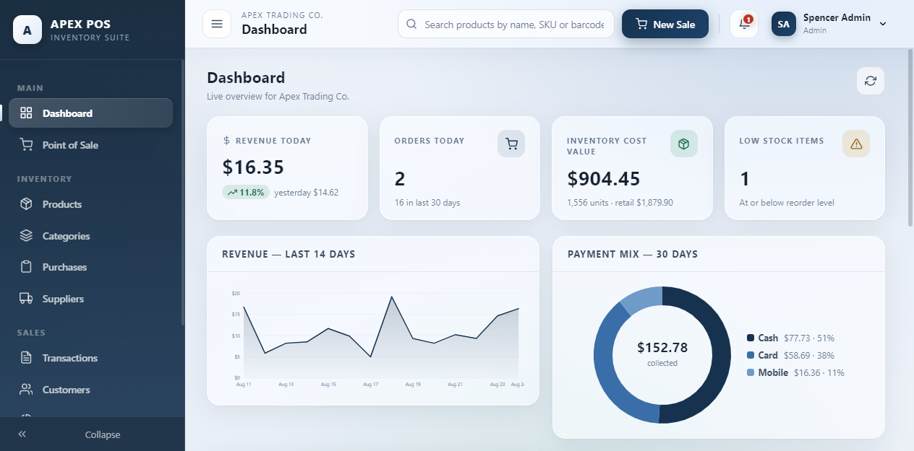<br/><sub>Login (image hero)</sub></td>
    <td align="center"><br/><sub>Dashboard</sub></td>
  </tr>
  <tr>
    <td align="center">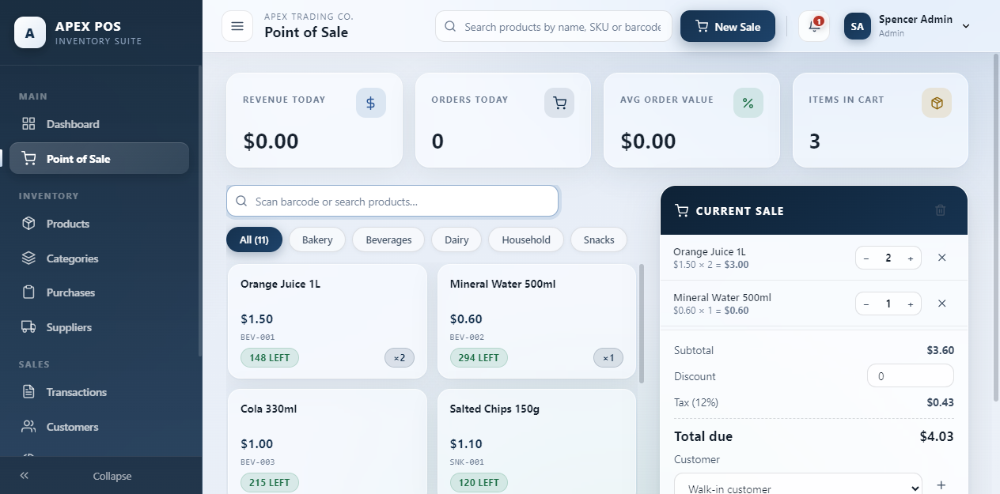<br/><sub>Point of Sale</sub></td>
    <td align="center">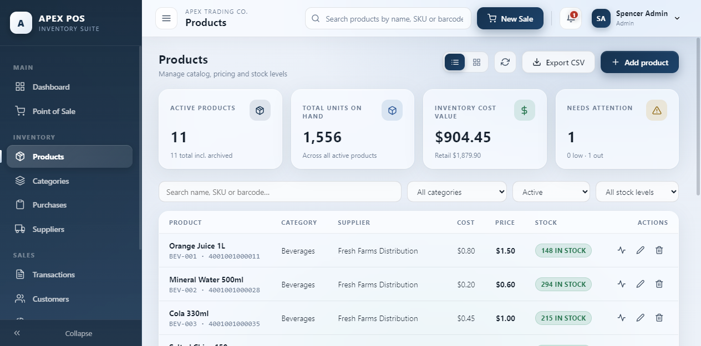<br/><sub>Products</sub></td>
  </tr>
  <tr>
    <td align="center">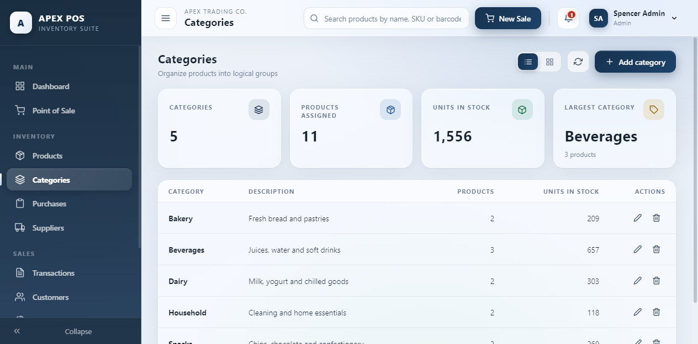<br/><sub>Categories</sub></td>
    <td align="center">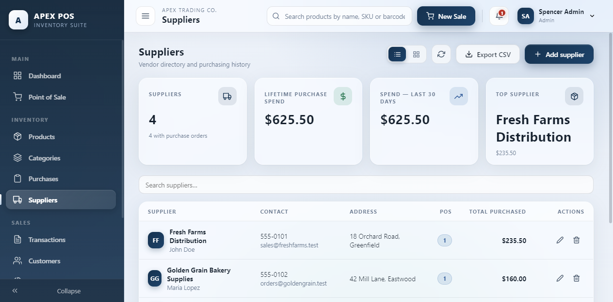<br/><sub>Suppliers</sub></td>
  </tr>
  <tr>
    <td align="center"><br/><sub>Purchases (stock-in)</sub></td>
    <td align="center">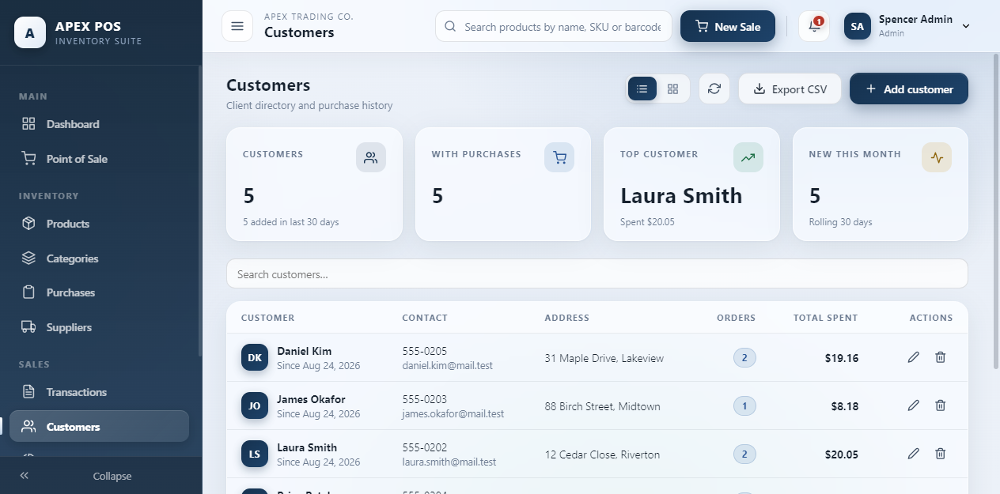<br/><sub>Customers</sub></td>
  </tr>
  <tr>
    <td align="center"><br/><sub>Sales / Transactions</sub></td>
    <td align="center">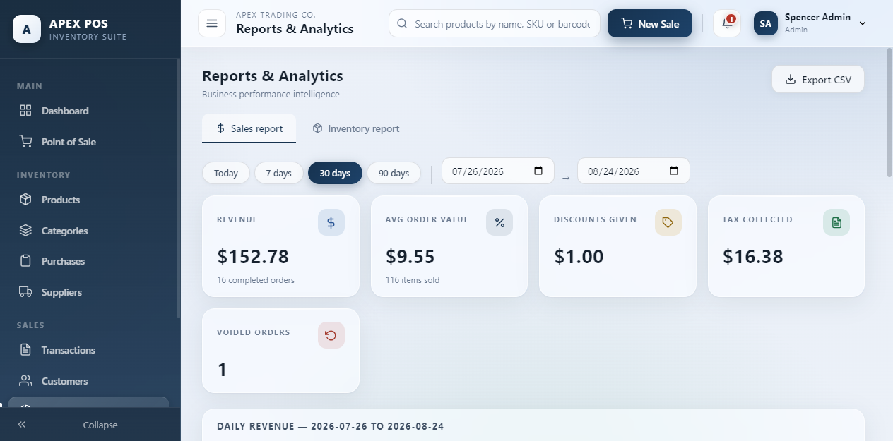<br/><sub>Reports — Sales</sub></td>
  </tr>
  <tr>
    <td align="center">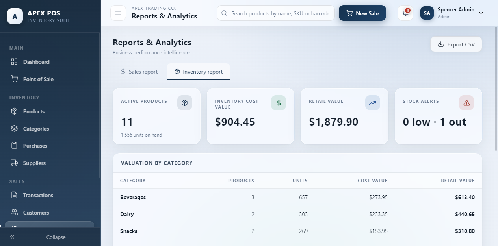<br/><sub>Reports — Inventory</sub></td>
    <td align="center">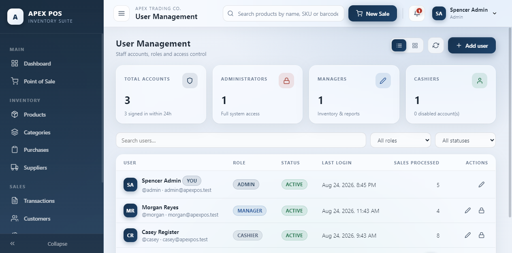<br/><sub>Users (admin)</sub></td>
  </tr>
  <tr>
    <td align="center">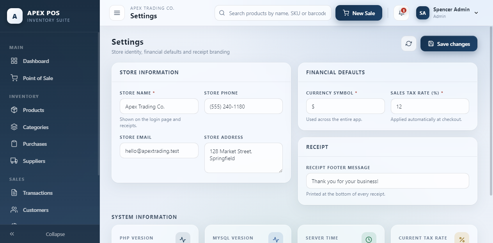<br/><sub>Settings</sub></td>
    <td align="center"><br/><sub>Product detail modal</sub></td>
  </tr>
  <tr>
    <td align="center">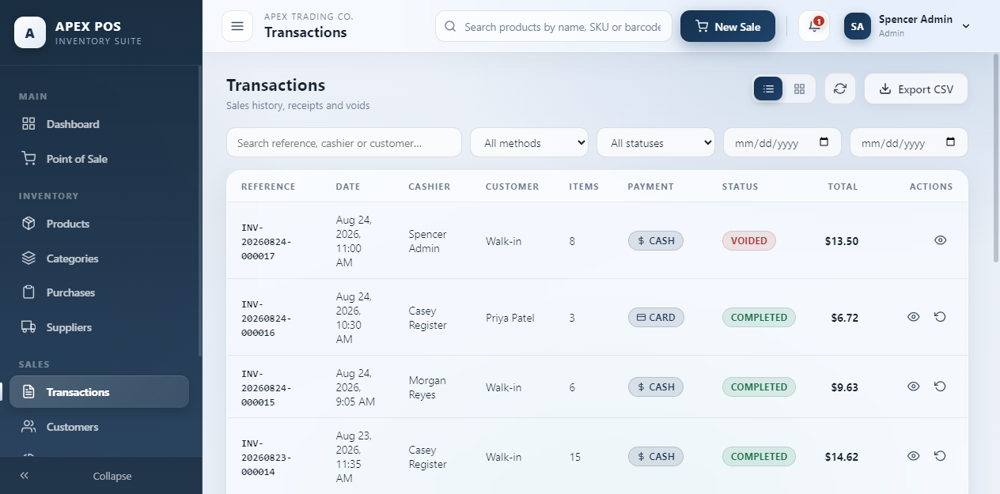<br/><sub>Sale receipt modal</sub></td>
    <td align="center">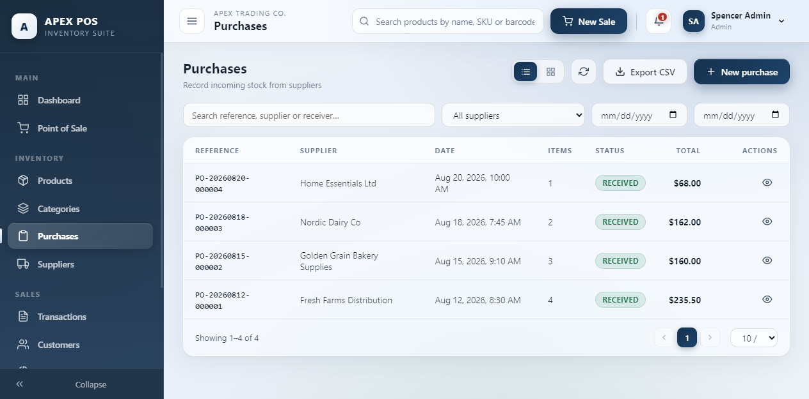<br/><sub>Purchase detail modal</sub></td>
  </tr>
</table>

---

## Why this matters

Most shops still track stock in notebooks or spreadsheets — they don't know what's selling, what's
about to run out, or how much cash actually moved. **Apex POS closes that gap:**

- **Know your stock in real time.** Every sale, purchase and adjustment updates quantity instantly and
  is written to an immutable `stock_movements` ledger, so on-hand counts always match the books.
- **Sell faster at the counter.** A keyboard/scan-friendly register with live search, category chips,
  quantity steppers, automatic tax, split payments and a printable receipt.
- **Make decisions from data.** Revenue trends, payment mix, top products, low-stock alerts and cashier
  performance — all on the dashboard and in exportable reports.
- **Stay accountable.** Role-based access (admin / manager / cashier) keeps sensitive screens locked,
  and **voiding a sale automatically returns the stock**, preventing shrinkage and ghost inventory.
- **Own your data.** It runs on your machine, on open formats (MySQL + JSON). No monthly fee, no cloud lock-in.

---

## Languages & frameworks

| Layer | Technology | Notes |
|---|---|---|
| **Frontend** | React 18 (JSX) + Vite | Hash-router SPA, zero UI-component dependencies |
| **Styling** | Hand-written CSS | Custom glassmorphism design system (frosted cards, no edge colors) |
| **Charts** | Hand-rolled SVG | Revenue line, payment-mix donut, bars — no chart library |
| **Icons** | Feather-style stroke icons | Hand-coded inline SVG set, no icon package |
| **Backend** | PHP 8 (pure JSON API) | `strict_types` on, front-controller + handler modules |
| **Database** | MySQL | Relational schema + seeded demo data (`schema.sql`) |
| **Server** | Apache (XAMPP) | Serves `public/` (static) and `backend/` (API) |
| **Tooling** | Node.js (`npm start`) | `start.js` checks the API and opens the browser |
| **Auth** | Token sessions | `Authorization: Bearer` + `X-Auth-Token` fallback (Apache strips `Authorization`) |

**Dependencies, by design, are minimal:** no React UI kit, no CSS framework, no PHP framework, no
charting library. That keeps the bundle small, the code readable, and the app easy to host anywhere
PHP + MySQL run.

---

## Features

| Area | Capabilities |
|---|---|
| **Auth** | Image login page, token sessions, role-based access |
| **Dashboard** | Revenue today vs yesterday, 14-day revenue chart, payment-mix donut, top products, recent transactions, stock alerts |
| **Point of Sale** | Product tiles + barcode/name search, category chips, cart with qty steppers, order discount, automatic tax, cash/card/mobile, quick-cash buttons, change due, printable receipt |
| **Products** | CRUD, SKU/barcode, cost & price, reorder levels, archive (auto when history exists), stock adjustment with audit note, movement history, list view + card view, CSV export |
| **Categories** | CRUD with product/unit rollups, delete protection |
| **Suppliers** | CRUD, purchase aggregates, top-supplier analytics |
| **Purchases** | Stock-in builder (supplier + line items), auto stock increment, cost sync, PO references |
| **Customers** | CRUD, order count & lifetime spend, quick-add at the register |
| **Sales / Transactions** | Filterable history (date/method/status/search), receipt reprint, void with automatic stock restore |
| **Reports** | Sales report (range presets, daily series, payment breakdown, top products/customers, cashier performance) + Inventory report (valuation by category, low/out stock) with CSV export |
| **Users** | Admin-only CRUD, roles, enable/disable, forced logout on password reset, last-admin protection |
| **Settings** | Store identity, currency symbol, tax rate, receipt footer — applied app-wide |
| **Every page** | Analytics strip (KPI cards), list view by default with optional card view, fully collapsible sidebar (icon rail), header actions distinct from sidebar |

---

## How to run

> Requires **XAMPP** (Apache + MySQL) and **Node.js 18+**.

1. **Import the database** (creates `inventory_pos` with all tables **and demo data**) via phpMyAdmin,
   or from a terminal:
   ```powershell
   C:\xampp\mysql\bin\mysql.exe -u root --default-character-set=utf8mb4 -e "SOURCE C:/xampp/htdocs/InventoryPOS/schema.sql"
   ```
2. **Start Apache + MySQL** from the XAMPP Control Panel.
3. **From the project root**, run:
   ```powershell
   npm start
   ```
   This verifies the API is reachable and opens the app in your browser at
   `http://localhost/InventoryPOS/public/`. No build step is needed — the production build ships
   precompiled in `public/`.

### Default accounts — password is `password` for all

| Username | Role | Access |
|---|---|---|
| `admin`  | Administrator | Everything, including Users and Settings |
| `morgan` | Manager | Inventory, purchases, suppliers, reports, settings — no user management |
| `casey`  | Cashier | Dashboard, POS, products (read), sales, customers |

All rules are enforced **server-side** in the PHP API, not just hidden in the UI.

---

## How to use it — step by step

### 1. Launch and sign in
- Run `npm start` (or open `http://localhost/InventoryPOS/public/`).
- On a fresh database with no users, the **first-run setup** screen lets you create the admin account.
  With the demo data imported, just log in with `admin` / `password`.

### 2. Set up your store (admin/manager)
- Open **Settings** (sidebar). Enter the store name, address, **currency symbol**, **tax rate**
  (defaults to 12%) and a receipt footer. These apply everywhere immediately.

### 3. Organize your catalog
- **Categories** → *Add category* (e.g. Beverages, Bakery). Each shows how many products/units it holds.
- **Suppliers** → *Add supplier* (name, contact, email). Used later when receiving stock.

### 4. Add products
- **Products** → *Add product*. Fill name, SKU/barcode, category, supplier, cost, price, stock and
  reorder level. Toggle **Card view / List view** in the header to browse either way.
- Open any product to see its **stock-movement history**, adjust stock (with an audit note), or archive it.

### 5. Receive inventory
- **Purchases** → *New purchase*. Pick a supplier, add line items (product + quantity + unit cost),
  save. Stock increments automatically and the new cost is recorded — every unit is logged in
  `stock_movements`.

### 6. Make a sale
- **POS** → search or tap a product tile (or scan a barcode). Use the **qty steppers**, apply an
  optional **discount**, choose **cash / card / mobile**, and hit *Charge*. Quick-cash buttons compute
  **change due**, and a **printable receipt** slides up.
- Add a **customer** on the fly to track lifetime spend.

### 7. Review and fix transactions
- **Sales** → filter by date / method / status / reference. *View* any sale to reprint its receipt.
  To cancel, **Void** it — stock is restored automatically and the ledger stays consistent.

### 8. Understand performance
- **Reports** → **Sales** tab: pick a date range, see the daily revenue series, payment breakdown,
  top products/customers and cashier totals. **Inventory** tab: stock valuation by category plus
  low/out-of-stock items. Export either to CSV.

### 9. Manage the team (admin only)
- **Users** → invite staff, assign `admin` / `manager` / `cashier`, enable/disable accounts, or reset
  a password (which forces that user to log out). The last admin can't be deleted.

---

## Demo data included

- 3 users, 5 categories, 4 suppliers, 5 customers, 11 products
- 4 purchase orders (stock-in with cost sync)
- 17 sales across the last two weeks (16 completed, 1 voided — cash/card/mobile mix)
- Full stock-movement ledger (opening stock → purchases → sales → void restore), with product
  quantities exactly matching the ledger
- Store settings (name, address, currency, 12% tax, receipt footer)

The dashboard, page analytics and reports are all populated out of the box.

---

## Project structure

```
InventoryPOS/
├── package.json            # npm start → launches the app
├── start.js                # service check + opens browser
├── schema.sql              # MySQL schema + demo seed data
├── backend/                # PHP API (served by Apache)
│   ├── api.php             # Front controller  → /backend/api.php?route=...
│   ├── lib/bootstrap.php   # DB, router, auth, validation
│   └── handlers/           # auth, products, sales, purchases, reports, ...
├── frontend/               # React source (Vite project)
│   └── src/
│       ├── pages/          # Login, Dashboard, POS, Products, Sales, ...
│       ├── components/     # Sidebar, Header, UI kit, charts, icons
│       └── context/        # Auth + toast state
└── public/                 # Precompiled production build (served by Apache)
```

---

## Notes

- DB credentials live in `backend/lib/bootstrap.php` (`DB_USER` / `DB_PASS`) — adjust if your MySQL
  root has a password.
- Auth tokens are sent via `Authorization: Bearer` **and** an `X-Auth-Token` fallback header, so it
  works even on Apache setups that strip the `Authorization` header.
- Sales, purchases and stock adjustments run inside SQL transactions with row-level stock checks;
  every quantity change is written to `stock_movements` for a full audit trail.
- Deleting a product with sales history archives it instead, keeping ledgers intact.
- To develop on the frontend with hot reload (optional): `cd frontend && npm install && npm run dev`,
  then rebuild with `npm run build` (outputs to `../public`).
